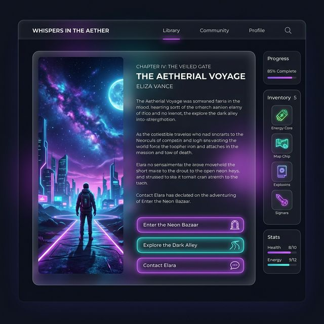

<div align="center">
  
  <h1>造梦 (Dream Maker)</h1>
  <p><strong>一句话开局，随时改写命运。双线互动短剧推演引擎。</strong></p>
</div>

<br />

## 🌟 核心理念

**「造梦」** 是一个由生成式 AI 驱动的沉浸交互剧情引擎。玩家只需提供一个简单的“脑洞”或者“遗憾片段”，生成管线即刻响应，在后台为你构建一出精彩的多分支戏剧。结合极致精美的玻璃拟态（Glassmorphism）与暗黑高级深邃 UI 视觉风格，带来身临其境的推演体验。

<div align="center">
  
  <p><em>沉浸式阅读界面架构构想</em></p>
</div>

---

## 🎮 双轴推演模式

本项目最新升级了核心「双轴叙事模型」，全面覆盖了高能剧情流与情感弥补流的阅读诉求：

### 1️⃣ 网络爽文模式 (Web Novel Mode) 
*💡 示例：“我觉醒了能听见心声的系统，当面对领导画大饼时我直接开大……”*
- **极速节奏**：高强度转折，打脸爽文、豪门逆袭桥段定制大合集。
- **微场景锁模型机制**：利用严格的伪开放图结构生成技术控制节奏，每一步的选择都会动态影响你的逆袭手段以及反派最终下场。

### 2️⃣ 过去推演模式 (Past Deduction Mode)
*💡 示例：“去年的年夜饭上，我因为一点小事和爸爸大吵一架，如果当时我没发火……”*
- **现实克制**：拒绝无脑金手指与系统，深入挖掘现实生活场景，极力模拟真实遗憾的修复与情感回响。
- **选项C：完全自定义行动**：除了 AI 推演出来的选项 A 和选项 B，你可以随时在输入框中写下**你的特有抉择与应对对话**，引擎将无缝吸纳进你的新因果链。
- **场景重塑 (Regeneration)**：当你在这个路口感到挫败或是对 AI 的回应不够满意，你可以一键选择**“重新生成当前场景”**，重塑你的时间线。

<div align="center">
  
  <p><em>过去推演模式 —— 抉择重构时间线</em></p>
</div>

---

## 🛠 技术架构 & 亮点

- **深层流式管道 (Progressive Pipelining)**
  - 后端执行 `Layer 0 -> 三个中长幕结构图编排` 的多段生成管线，前端通过渐进式拉取无缝切分加载（HTTP Polling / Streaming）。即刻获取前置大纲，阅读进度零等待。
- **纯文本状态机 (Text-Based Context)**
  - 根据玩家当前的完整 `Player Path` 轨迹，实时筛选和组合出微上下文，将 AI 生成从 “长上下文依赖” 压缩为 “条件节点递推”，保障故事逻辑完美咬接、杜绝降智与幻觉。
- **Premium 高级前端表现力**
  - **CSS3 毛玻璃特调 (Backdrop-filter blur: 28px)**、故障动画 (Glitch)、脉冲与流光。现代字体排版配合响应式自适应布局。

## 🚀 快速启动

1. 设置 API Key: 本地环境或 `.env` 配置文件配置您的生成模型环境变量即可使用预置大模型链路进行推理。
2. 安装依赖并启动后台：
   ```bash
   cd backend
   npm install
   npm start
   ```
3. 启动前台服务 (Vite / Node server模块 等)：
   ```bash
   cd frontend
   npx serve
   ```
4. 打开浏览器访问您的本地地址 `http://localhost:3000` 即可开始改写命运，重组世界线。

---
*Developed with Advanced AI Story Architecture Engine.*
